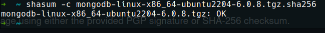
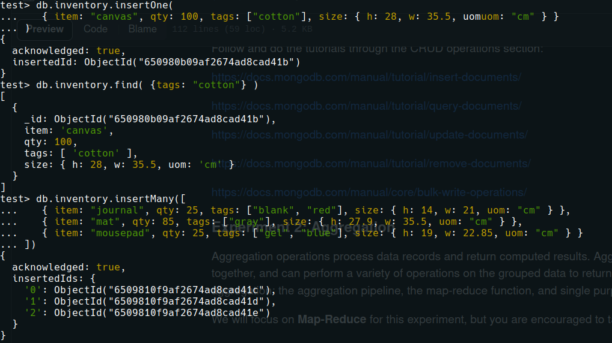
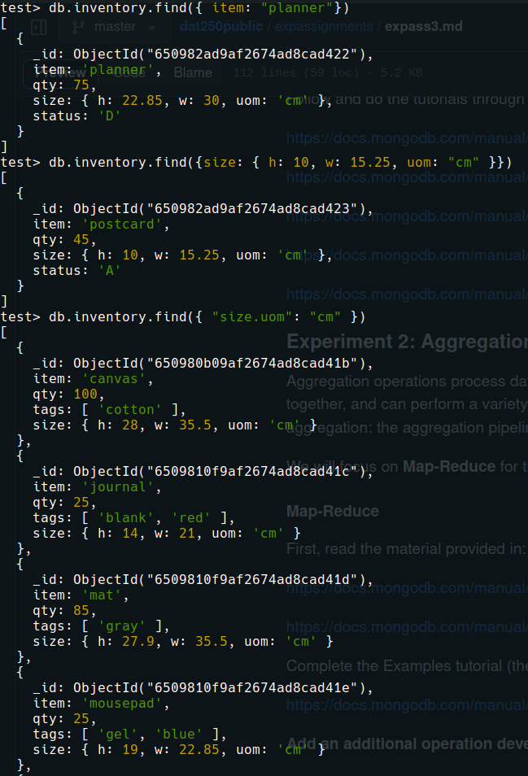
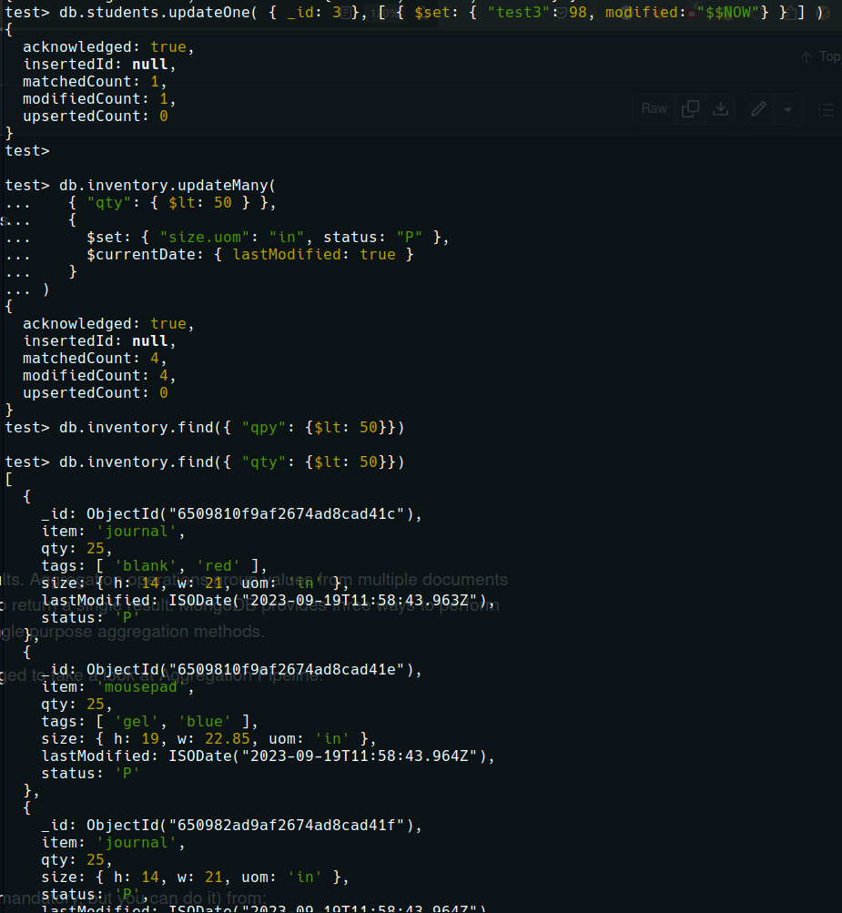
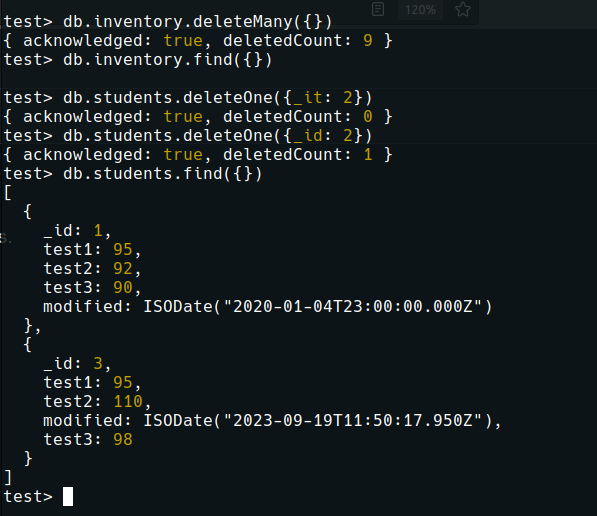
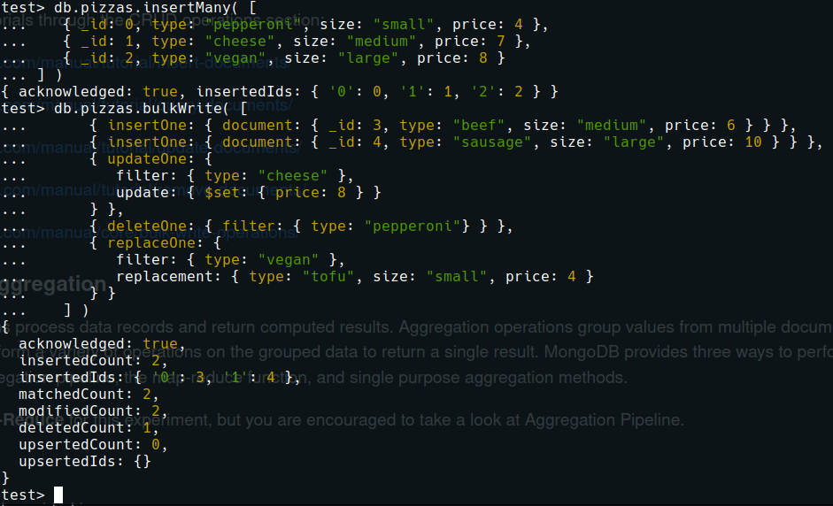
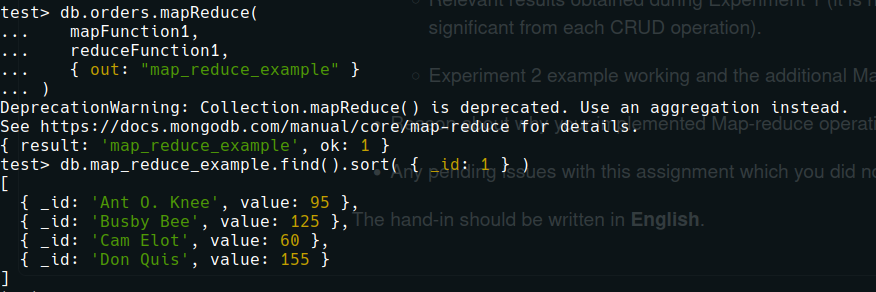
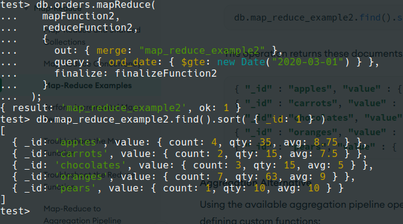
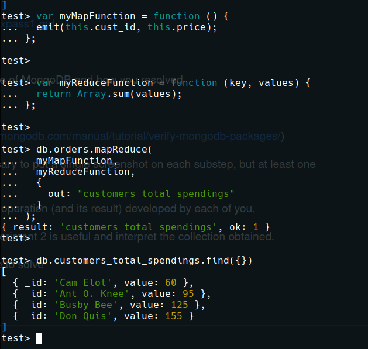

# Expass 3

### Technical problems that you encountered during installation and use of MongoDB and how you resolved:
MongoDB's installation and quickstart process was well documented and I did not encounter any tecchnical issues during this process.

### Screenshots for:

- The correct validation of the installation package (https://docs.mongodb.com/manual/tutorial/verify-mongodb-packages/)

- Relevant results obtained during Experiment 1.
  - <h3>Insert</h3>
  - 
  - <h3>Query</h3>
  - 
  - <h3>Update</h3>
  - 
  - <h3>Delete</h3>
  - 
  - <h3>Bulk operations</h3>
  - 
  
- Experiment 2 example
  
  

### My own map-reduce operation
I decided to create a map-reduce operation that finds the total amount each customer has spent.
This could be useful information for a marketing campaign or for deploying a loyalty program.

### Pending issue
I have no pending issues with this assignment
